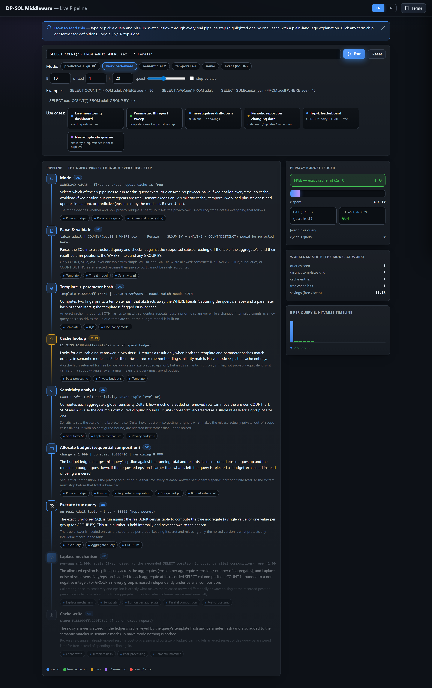
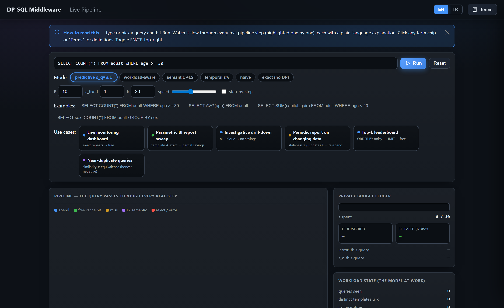
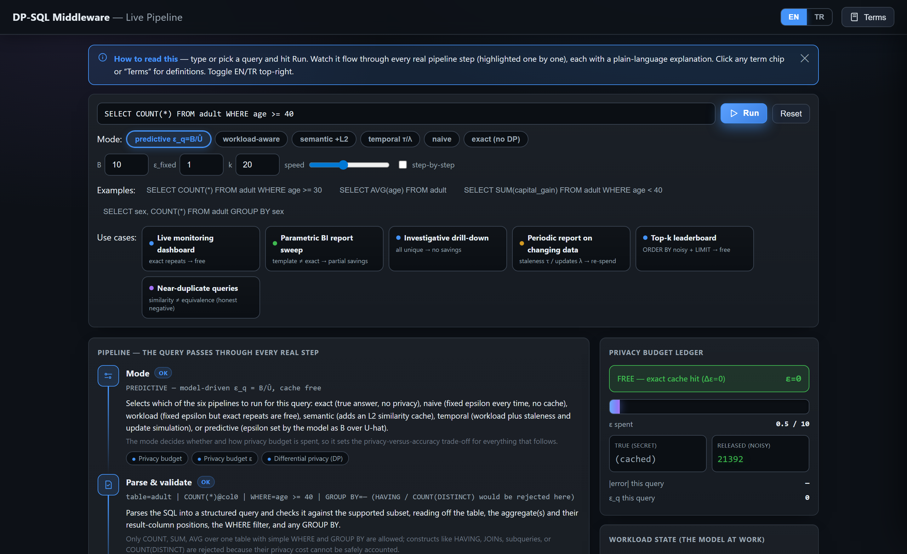

# 🔮 Forecasting Privacy-Budget Consumption in Repeated DP-SQL Workloads

**CMP653 — Database Management Systems · Hacettepe University**
Refik Can Öztaş (N25142279)

   

A differentially private SQL middleware that adds calibrated noise to `COUNT` / `SUM` / `AVG` queries — **plus a simple formula that predicts how much privacy budget a workload will spend _before you run a single query_.**

> **▶ Try it live:** `pip install flask duckdb && python demo/app.py` → http://127.0.0.1:5000
> Watch every query flow through the **real** pipeline step by step, with a live budget meter, in English or Turkish.

<p align="center">
  <br>
  <em>The interactive demo runs the real middleware and narrates every step — parse, cache, noise, budget ledger — live.</em>
</p>

---

## 🤔 The problem, in one breath

A single `COUNT` looks harmless — it returns one number, never a row. But ask *"how many patients are HIV-positive?"* and then *"how many **other than Alice**?"*, and the difference unmasks Alice. **Differential privacy** stops this by adding noise to every answer — but each answer spends a slice of a fixed **privacy budget**, and on a busy dashboard that budget drains fast. When it's gone, no more queries.

## 💡 The one idea (no math required)

Real dashboards **repeat**: the same tiles refresh on a schedule, the same drill-downs run again and again. An **exact repeat is free** — you can hand back the noisy answer you already computed at no extra privacy cost.

So the budget isn't driven by *how many* queries you ask — it's driven by **how many _distinct_ queries** you ask. And because repetition is a property of the *workload*, not the data, you can **forecast the spend in advance**.

> **That forecast — closed-form, before execution — is the contribution.** Caching is a known trick; *predicting its budget impact ahead of time* is the new part.

<details>
<summary>📐 …okay, one formula (click to expand)</summary>

If each distinct query *i* recurs with probability `p_i`, the expected number of **distinct** queries in a length-`k` workload is

```
E[u_k] = Σ_i ( 1 − (1 − p_i)^k )
```

`(1−p_i)^k` is the chance query *i* never appears; one minus that is the chance it appears at least once. You only pay budget the first time each distinct query is seen, so the expected spend is `ε_q · E[u_k]` and the savings vs. naïve accounting is `S(k) = 1 − E[u_k]/k`.

**Worked example.** 3 dashboard tiles asked 70% / 20% / 10% of the time, refreshed 100× → `E[u_k] ≈ 3`. You pay for ~3 distinct queries, not 100 refreshes — **97% saved**, and the formula says so before anything runs.
</details>

---

## 🆕 What's new (and what isn't)

We're careful to claim only what we can show:

| | |
|---|---|
| ✅ **New capability** | A **before-execution** forecast of a repeated workload's budget — to our knowledge the first to do this **in closed form from public structure alone** (`{p_i}`, `k`, `B`), with no query run and the data never touched. It reports the **expected spend**, a **hard completion guarantee** (the safe `ε_q = B/m` sizing never overruns), and a **per-release accuracy** verdict. *(The closest proactive work, LAPRAS, instead precomputes on a predicted query set and touches the data.)* |
| ✅ **Measured improvement** | On **30 real-trace workloads** (Redbench, from Amazon Redshift logs), forecasting the full workload from only its **first half** cuts the prediction error by **45%** (0.22 → 0.12) over the naïve plug-in. |
| 🤝 **On par, not ahead** | DP caches (Turbo, CacheDP) reach the same savings *reactively*; on the raw number we're **level, not better**. Our edge is the forecast they don't expose, not a bigger multiplier. |
| ❌ **We do _not_ claim** | to beat deployed DP caches, or that exact-repeat caching is novel. |

**Two cases the forecast handles that reactive systems don't:**
1. **Size before you spend.** *"Will this month's dashboard finish within budget at the target accuracy?"* — answered at `t=0`, before any query runs. Reactive systems only learn this by spending budget query-by-query.
2. **Plan from a prefix.** Predict a whole workload's cost from its first half (the Redbench result above).

---

## 🎬 See it live

```bash
pip install flask duckdb        # numpy / sqlglot come with the project
python demo/app.py              # → http://127.0.0.1:5000
```

The page animates **exactly the steps `DPMiddleware.execute()` takes** — it drives the real ledger, cache, and noise, so it *is* the real system, narrated. Pick a **mode** (exact, naïve, workload-aware, semantic, temporal, predictive) and a **workload preset** (W1 repetitive, W2 parametric, W4 drill-down) and watch the budget deplete, cache hits go free, and the predictive allocator adapt on the fly.

<p align="center">
  
  <br>
  <em>Left: the interface (query box, modes, workload presets). Right: predictive mode adapting ε per query.</em>
</p>

Plain-language explanations sit under every step (EN/TR toggle), with a searchable glossary. See [`demo/README.md`](demo/README.md).

---

## 📊 Results at a glance

**Budget saved vs. naïve composition** (k=100, 30 trials):

| Workload | Saved | Why |
|---|---|---|
| Repetitive (1 tile) | **100×** | one distinct query |
| Parametric / Zipf pools | **14–33×** | a handful of distinct queries |
| Drill-down (all unique) | **1× (none)** | the model *correctly predicts* no savings |

**Forecast accuracy**
- Matches the realized budget within **< 3%** in **21 / 24** validation cells.
- **Scale-invariant** (6M vs 60M rows agree within 0.034) and **budget-invariant** — so you can plan capacity before deploying.
- **Headline (real traces):** prefix forecast cuts error **45%** (0.22 → 0.12) on Redbench.

**Allocation** — the safe `ε_q = B/m` allocator answers **100%** of queries at MAE **2.0** vs an ε-greedy bandit's **3.8** (the bandit pays an *exploration tax* to reach the point we compute in closed form).

> Full campaign: **~8,000 trials across 13 scripts**; every number has a script that reproduces it.

---

## 🧱 How it works

```
query → parse & validate → hash (cache key) → cache?
                                                ├─ hit  → return noisy answer  (FREE, ε = 0)
                                                └─ miss → sensitivity → spend ε_q → Laplace noise → cache
```

- **Middleware** ([`src/dpdb/middleware.py`](src/dpdb/middleware.py)) — six execution modes over DuckDB / PostgreSQL.
- **The model** ([`src/dpdb/model.py`](src/dpdb/model.py)) — the closed-form forecast + its limits, with proofs and tests.
- **Predictive allocator** ([`src/dpdb/predictive.py`](src/dpdb/predictive.py)) — estimates the distinct-query count live and sets `ε_q = B/Û`.
- **Safety** — `SUM`/`AVG` are clamped to public bounds inside the SQL; the parser rejects anything that could amplify or hide a row's contribution (window functions, self-union CTEs, arithmetic-wrapped aggregates, `OFFSET`, …).

**Honest negatives** (the kind that make a project credible):
- A semantic "AI cache" (tree-kernel + embedding) saves budget but returns **wrong** answers — similarity ≠ equivalence. Reported as a cautionary result.
- `GROUP BY` / top-k guarantees assume a **public, fully enumerated** key domain — a stated scope boundary, not hidden.
- A workload-level membership-inference probe was **inconclusive** (too few sequences) — reported as a negative, not spun as a finding.

---

## 🚀 Quick start

```bash
pip install -e ".[dev]"            # install
python -m pytest tests/ -q         # 134 passing
python -m dpdb.model               # model self-check (limit cases)
python demo/app.py                 # interactive demo
```

Reproduce an experiment:
```bash
python experiments/model_validation.py    --trials 30     # main grid
python experiments/redbench_validation.py                 # real-trace headline
python experiments/aggregate_all_results.py               # → results/REPORT.md
```

---

## 🗂️ Repo layout

```
src/dpdb/        the middleware + the model        (model, predictive, budget, middleware, parser, …)
experiments/     every figure/number has a script  (model_validation, redbench_validation, leakage, …)
tests/           134 unit tests
demo/            interactive web demo (Flask) + screenshots
report/          the paper — report/course_paper.pdf  (+ .tex source)
results/         generated figures & CSVs
```

---

## 📄 Paper

The full write-up is **[`report/course_paper.pdf`](report/course_paper.pdf)** — *Forecasting Privacy-Budget Consumption in Repeated DP-SQL Workloads* (12 pp): the model and its five propositions, a 4,155-trial validation, the Redbench real-trace result, two leakage experiments, and honest limitations.

> **Scope, stated plainly.** The synthetic grid is a *self-consistency* check; the real external evidence is the Redbench prefix forecast. Savings genuinely vanish on workloads that never repeat — which the model predicts rather than hides.
